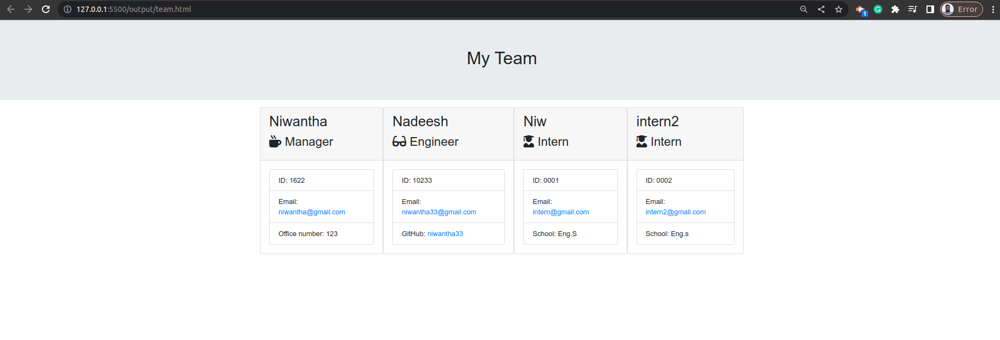

# team-profile-generator

[HTML Output](./output/team.html)

This project is a command-line application that takes in information about employees on a software engineering team and generates an HTML webpage that displays summaries for each person. 

The user will be prompted to enter information about the team manager, 

- Team manager's:
    - Name
    - Employee ID
    - Email address

-  Menu with the option
    - Add an engineer
    - Add an intern
    - Finish building the team
- Engineer option 
    - Engineer's Name
    - ID
    - Email
    - GitHub username

- Intern option
    - Intern’s name
    - ID
    - Email
    - School

The application uses the Inquirer.js npm package to collect the user's input and generates HTML code. The final result is a webpage that displays each team member's name, ID, email, and specific information depending on their role 

## Credits

[Error [ERR_REQUIRE_ESM]](https://gist.github.com/sindresorhus/a39789f98801d908bbc7ff3ecc99d99c)

[Inquirer Example](https://www.npmjs.com/package//inquirer?activeTab=readme#examples)

[existsSync](https://www.geeksforgeeks.org/node-js-fs-existssync-method/)